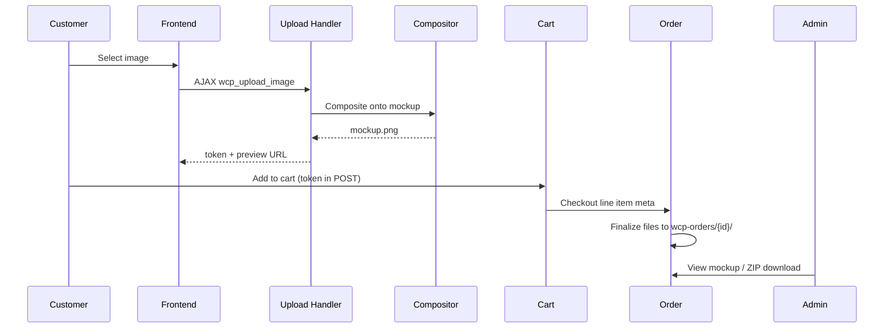

# Architecture

High-level overview of the Woo Personalization plugin (`woo-personalization/`).

## Module map

```
WCP_Plugin (orchestrator)
├── WCP_Template_CPT        Mockup template library + print area editor
├── WCP_Product_Settings    Per-product enable/template/override
├── WCP_Frontend            Product page upload UI
├── WCP_Upload_Handler      AJAX upload + temp storage
├── WCP_Image_Compositor    GD composite (design → mockup PNG)
├── WCP_Cart_Order          Cart meta, order meta, file finalization
├── WCP_Frontend_Order      Thank you / view order mockups
├── WCP_Frontend_Orders_List My Account orders Design column
├── WCP_Order_Email         HTML email mockups
├── WCP_Admin_Order         Order item meta + secure download
├── WCP_Admin_Orders_List   Admin orders list Design column
├── WCP_Admin_Order_Zip     ZIP export all design files
├── WCP_Admin_Dashboard     Recent personalized orders widget
├── WCP_Settings            WooCommerce settings tab
├── WCP_Dpi_Checker         Print quality estimation
├── WCP_System_Status       WooCommerce status report
└── WCP_Cleanup             Cron temp file cleanup
```

## Data flow



## Storage layout

```
wp-content/uploads/wcp-uploads/
├── wcp-temp/{token}/          # Session uploads (cleaned by cron)
│   ├── original.{ext}
│   ├── mockup.png
│   └── meta.json
└── wcp-orders/{order_id}/
    └── item-{item_id}/
        ├── original.{ext}
        └── mockup.png
```

## Order line item meta

| Meta key | Purpose |
|----------|---------|
| `_wcp_personalized` | `yes` flag |
| `_wcp_upload_token` | Temp session token |
| `_wcp_template_id` | Mockup template ID |
| `_wcp_print_area` | JSON print area % |
| `_wcp_order_original_path` | Permanent original path |
| `_wcp_order_mockup_path` | Permanent mockup path |

## HPOS

The plugin declares compatibility with WooCommerce custom order tables. Admin order list hooks branch on `OrderUtil::custom_orders_table_usage_is_enabled()`.

## Extension points

Future hooks (not yet implemented) could include:

- `wcp_before_composite` / `wcp_after_composite`
- `wcp_order_files_finalized`

Open an issue if you need a specific filter for your integration.
